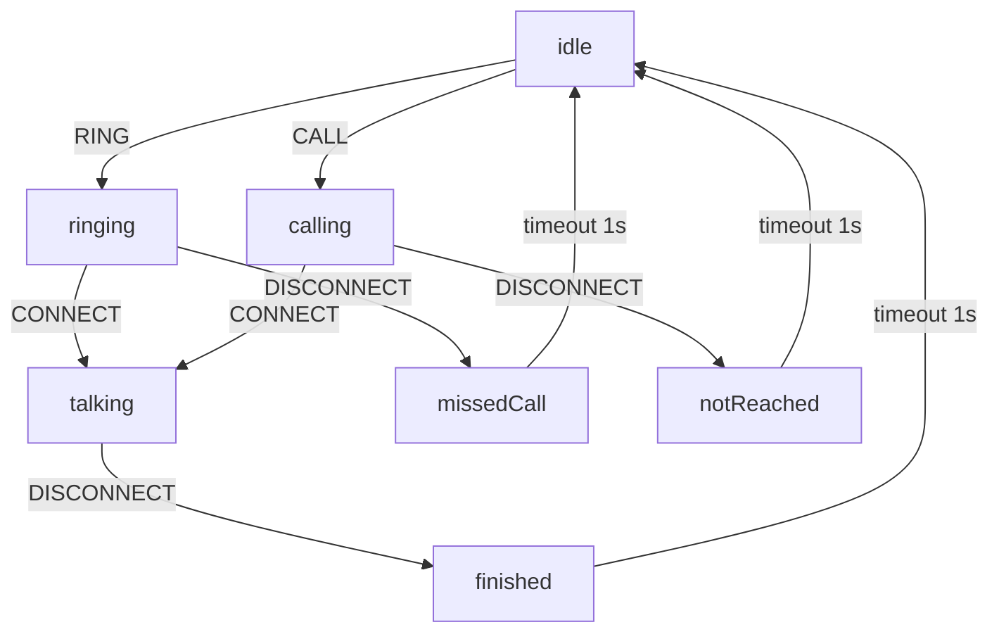

# Finite State Machine for Call Status

## Overview

The CallStatus system has been refactored into a Finite State Machine (FSM) that manages structured state transitions for phone calls. The system implements the following state diagram:



## Components

### 1. CallStateMachine (`fsm.go`)
- **Purpose**: Manages state transitions for a single line
- **Functions**:
  - `ProcessEvent(CallType) CallStatus`: Processes events and updates the status
  - `GetState() CallStatus`: Returns the current status
  - `IsValidTransition(CallType) bool`: Checks if a transition is valid
  - `Reset()`: Resets the FSM to idle state
- **Features**:
  - Thread-safe implementation
  - Automatic timeouts for final states
  - Callback support for status changes

### 2. LineStateMachine (`line_state_machine.go`)
- **Purpose**: Manages multiple CallStateMachines for different lines
- **Functions**:
  - `ProcessCallEvent(*CallEvent) CallStatus`: Processes CallEvents and updates corresponding line
  - `GetLineState(int) CallStatus`: Status of a specific line
  - `GetAllLineStates() map[int]CallStatus`: Status of all active lines
  - `ResetLine(int)`: Resets a specific line
- **Features**:
  - Automatic FSM creation for new lines
  - Central management of all line states
  - Cleanup functions for memory management

### 3. CallManager (`call_manager.go`)
- **Purpose**: High-level interface for call management with FSM
- **Functions**:
  - `ProcessEvent(*CallEvent) *CallEvent`: Processes events with validation
  - `SimulateCall()`: Demonstrates complete call flows
  - `GetStatusSummary() string`: Formatted overview of all line statuses
- **Features**:
  - Event validation before processing
  - Comprehensive logging support
  - Simulation functions for testing

## State Transitions

### Valid Transitions
- **idle**: RING → ringing, CALL → calling
- **ringing**: CONNECT → talking, DISCONNECT → missedCall
- **calling**: CONNECT → talking, DISCONNECT → notReached
- **talking**: DISCONNECT → finished

### Timeout Transitions (1 second)
- **notReached** → idle
- **missedCall** → idle
- **finished** → idle

### CallStatus Enum
```go
const (
    CallStatusIdle        CallStatus = "idle"
    CallStatusRinging     CallStatus = "ringing"
    CallStatusCalling     CallStatus = "calling"
    CallStatusTalking     CallStatus = "talking"
    CallStatusNotReached  CallStatus = "notReached"
    CallStatusMissedCall  CallStatus = "missedCall"
    CallStatusFinished    CallStatus = "finished"
    CallStatusMessageBox  CallStatus = "messageBox"  // Reserved for future use
)
```

## Integration with CallEvent

The `CallEvent` structure has been extended with a `Status` field:

```go
type CallEvent struct {
    // ... existing fields
    Status     CallStatus    `json:"status"`  // Current FSM status
    // ...
}
```

## Usage

### Basic Usage
```go
// Create CallManager
cm := NewCallManager(func(line int, oldStatus, newStatus CallStatus, event *CallEvent) {
    log.Printf("Line %d: %s -> %s", line, oldStatus, newStatus)
})
defer cm.Cleanup()

// Process event
event := &CallEvent{
    Line: 1,
    Type: CallTypeRing,
    // ... additional fields
}
cm.ProcessEvent(event)
```

### Direct FSM Usage
```go
// Single FSM for one line
fsm := NewCallStateMachine(nil)
defer fsm.Cleanup()

newStatus := fsm.ProcessEvent(CallTypeRing)
fmt.Printf("New status: %s", newStatus)
```

### Line State Machine
```go
// Manage multiple lines
lsm := NewLineStateMachine(nil)
defer lsm.Cleanup()

event := &CallEvent{Line: 1, Type: CallTypeRing}
status := lsm.ProcessCallEvent(event)
```

## Features

### Thread Safety
- All FSM components are thread-safe
- Uses `sync.RWMutex` for concurrent access
- Safe callback execution

### Timeout Management
- Automatic timeouts for final states
- Configurable timeout duration (default: 1 second)
- Proper cleanup on reset/shutdown

### Validation
- Event validation before processing
- Verification of valid state transitions
- Error handling for invalid events

### Monitoring
- Status callbacks for all changes
- Comprehensive logging support
- Status summaries

## Tests

Comprehensive test suite with:
- Unit tests for all components
- Integration tests for complex scenarios
- Concurrency tests for thread safety
- Timeout tests for automatic transitions
- Simulation tests for realistic call flows

All tests pass successfully with `go test ./pkg/types/`.

## Benefits of FSM Implementation

1. **Structured State Management**: Clear definition of allowed transitions
2. **Error Prevention**: Invalid state transitions are prevented
3. **Automation**: Timeouts for final states
4. **Scalability**: Support for multiple lines
5. **Extensibility**: Easy addition of new states/transitions
6. **Testability**: Deterministic state transitions
7. **Monitoring**: Complete tracking of status changes
